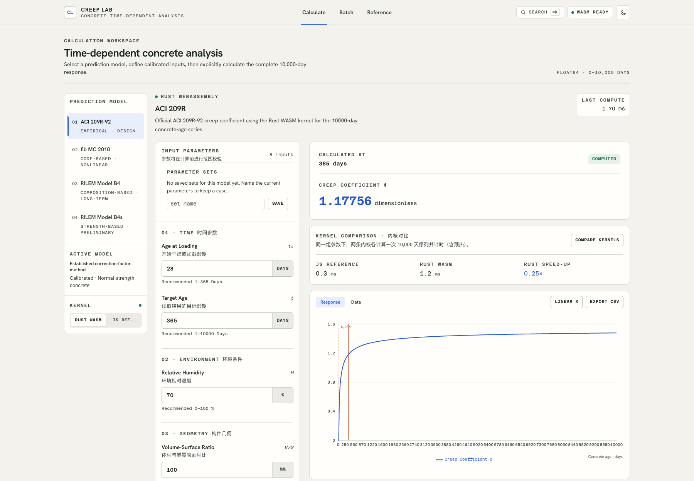
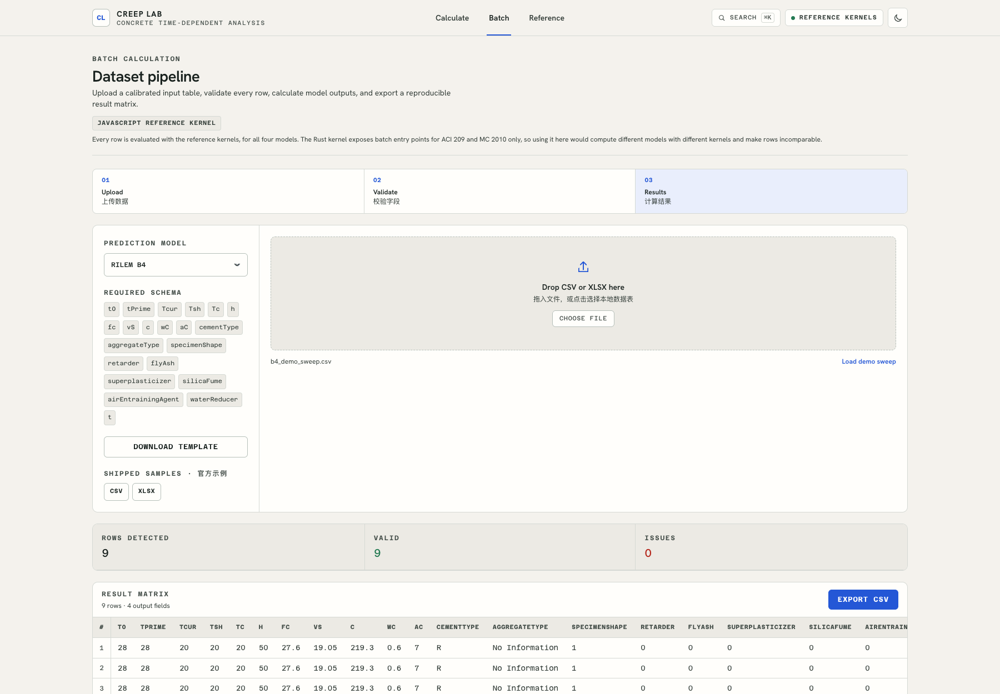
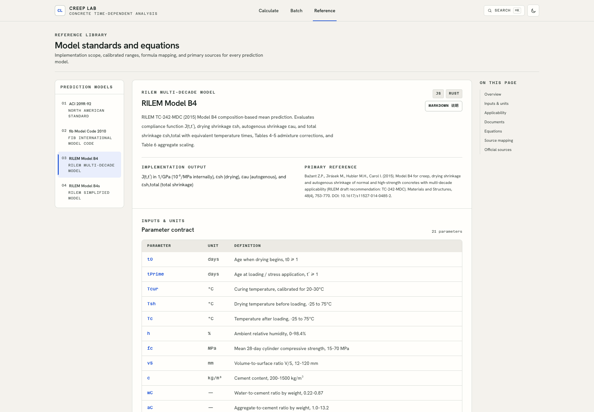
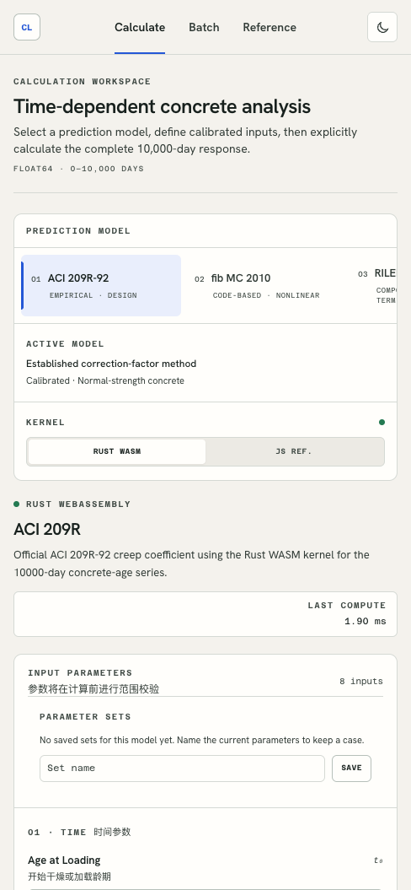
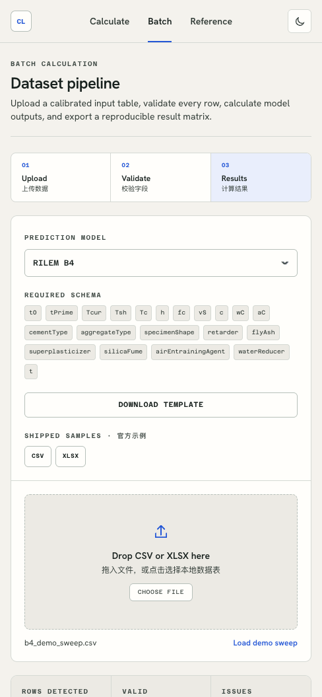
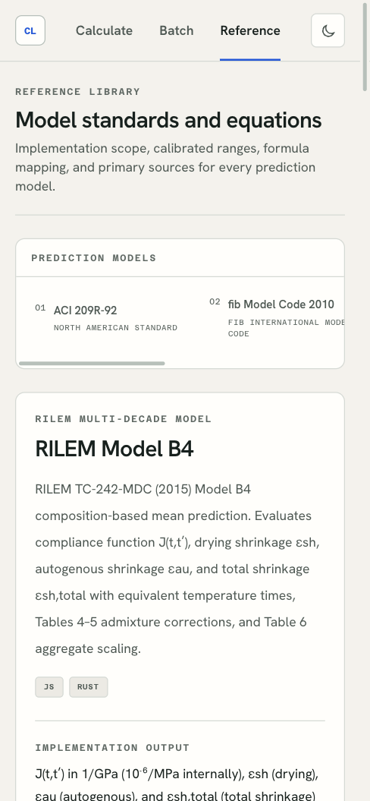

# CREEP_LAB 项目介绍

CREEP_LAB 是一个面向混凝土徐变与收缩分析的本地计算平台。项目集成 ACI 209R-92、fib Model Code 2010、B4、B4S 四类常用预测模型，提供单点参数分析、批量数据计算和模型公式文档浏览能力。

平台采用 React + Vite 构建前端界面，使用 Tailwind CSS 和项目内的 HALUNHAKU 设计规范统一视觉风格。计算层同时提供 JavaScript 参考实现与 Rust WebAssembly 高性能实现，用户可以在单点计算场景中切换引擎，便于对比结果、验证模型和观察性能差异。

## 核心功能

- 单点计算：选择模型和计算引擎，调整模型参数，生成指定时间范围内的徐变或收缩结果。
- 批量计算：导入 CSV 或 XLSX 数据表，每行作为一组工况自动计算，并输出结果矩阵。
- 结果可视化：批量结果支持散点图和折线图，便于观察参数与计算结果之间的趋势关系。
- 模型文档：内置模型说明、输入参数、输出量、参考文献和核心公式，并可下载各模型的 Markdown 说明文件。
- WASM 内核：Rust 计算模块已预编译到 `src/wasm-pkg/`，前端通过动态加载方式调用。

## 技术结构

| 层级 | 内容 |
| --- | --- |
| 前端框架 | React 19、Vite |
| 样式系统 | Tailwind CSS、CSS 变量、HALUNHAKU Design System |
| 图表 | Recharts |
| 文档公式 | KaTeX 渲染 + 模型说明 Markdown 下载 |
| 数据导入 | PapaParse、read-excel-file |
| 计算内核 | JavaScript shared kernels、Rust WebAssembly |
| 部署配置 | Cloudflare Pages / Wrangler |

## 主要界面

### 宽屏布局套图

在桌面宽屏下，各主界面会展开为更适合横向浏览的布局。单点计算页将参数面板、核心指标和系统日志分栏展示；批量矩阵页能同时呈现配置、表格和图表；模型文档页则把参数、输出、参考文献和公式内容组织在更宽的阅读空间里。







### 单点计算

单点计算界面用于选择算法、切换 Rust 或 JS 引擎，并通过参数面板调整模型输入。



### 批量矩阵

批量计算界面支持上传 CSV/XLSX、下载模板、加载示例数据，并展示计算后的结果表格与可视化图表。



### 模型文档

模型文档界面集中展示各模型的参数、输出、参考文献和核心公式，方便在计算过程中查阅依据。



## 适用场景

CREEP_LAB 适合用于混凝土长期性能分析、教学演示、模型对比、参数敏感性观察，以及需要从表格批量生成徐变或收缩预测结果的轻量工程计算场景。

## 本地运行

```bash
npm install
npm run dev
```

生产构建：

```bash
npm run build
```
