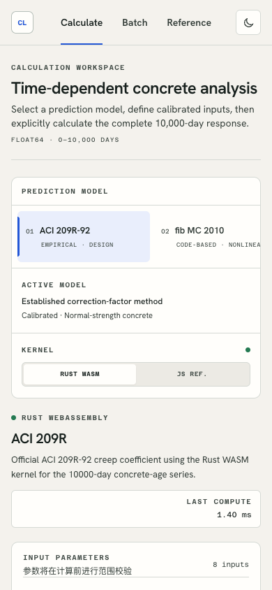
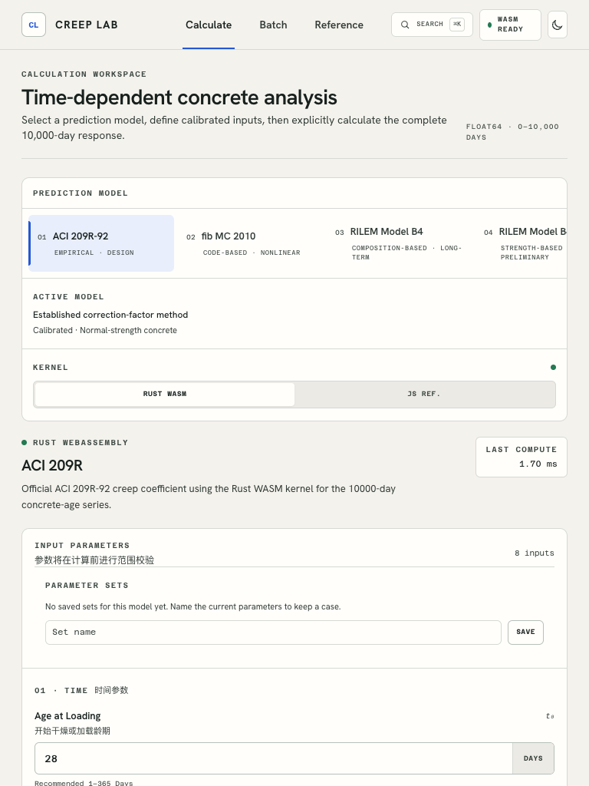
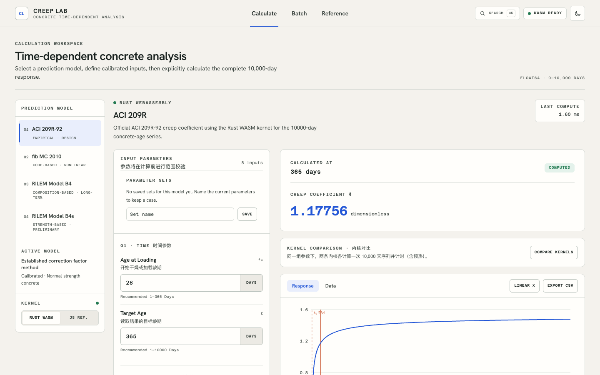
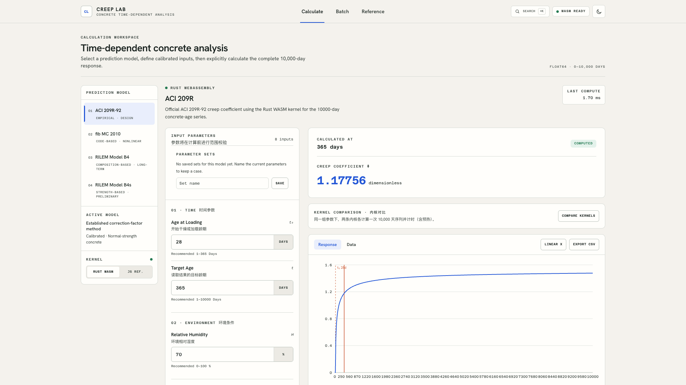
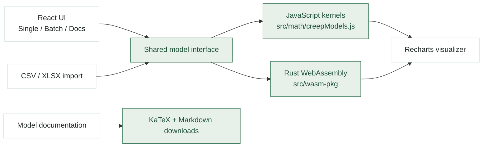

<p align="center">
  
</p>

<h1 align="center">CREEP_LAB</h1>

<p align="center">
  A quiet concrete creep and shrinkage calculation workspace with JavaScript and Rust WebAssembly engines.
</p>

<p align="center">
  <code>React 19</code>
  <code>Vite 8</code>
  <code>Rust WASM</code>
  <code>Recharts</code>
  <code>Tailwind CSS</code>
  <code>MIT</code>
</p>

---

## Overview

CREEP_LAB is a professional concrete creep and shrinkage calculation platform. It integrates ACI 209R-92, fib Model Code 2010, RILEM B4, and RILEM B4s behind a Scientific Workbench interface: precise grouped inputs, explicit calculation state, engineering-blue emphasis, decomposition readouts, model-aware charts, and standards-oriented reference pages.

The app is designed for local engineering exploration: tune model parameters, calculate long-term curves, import batch datasets, compare outputs, and read model documentation without leaving the workspace.

$$
\phi(t,t_0),\quad J(t,t'),\quad \varepsilon_{sh}(t)
$$

---

## Features

| Area | What it does |
| --- | --- |
| Calculation workspace | Select a model and engine, edit calibrated parameters, explicitly calculate, and inspect a target age within the 10,000-day series. |
| Batch pipeline | Upload CSV / XLSX cases, validate the schema and rows, inspect the result matrix, and export calculated outputs. |
| Result visualizer | Separate compliance and shrinkage curves, inspect decomposed values, switch linear/log time, and export chart data. |
| Reference library | Read implementation scope, calibrated ranges, equations, source mapping, limitations, and official references. |
| Dual engine | Use pure JavaScript reference kernels or Rust WebAssembly kernels, with a parity suite and an in-app timing comparison between them. The batch pipeline computes with the reference kernels for all four models — the Rust kernel exposes batch entry points for ACI 209 and MC 2010 only, so using it there would compute different models with different kernels. |
| Command palette | `⌘K` / `Ctrl+K`, or the header's Search button, reaches every destination from anywhere: workspaces, models, kernels, saved parameter sets, the reference library's sections, and the theme. |
| Shareable state | The workspace, model and kernel live in the URL (`?mode=docs&model=b4&kernel=js`), so a view can be linked to, Back and Forward move between workspaces, and a refresh keeps the edited parameters. |

### Deep links

```
/?mode=single|batch|docs   which workspace
/?model=aci209|mc2010|b4|b4s   which model (calculation and reference library)
/?kernel=rust|js           which engine the calculation workspace uses
```

Defaults are omitted, so a plain visit has a clean URL. The batch dataset is
deliberately not in the URL — it is a file, not a link — but it does survive
switching workspaces. Edited parameters are persisted locally and are kept out
of the URL; named, shareable parameter sets are future work.

---

## Interface Preview

### Wide Workspace

| Single analysis | Batch matrix |
| --- | --- |
|  |  |

| Model docs |
| --- |
|  |

### Tall / Narrow Views

| Single analysis | Batch matrix | Model docs |
| --- | --- | --- |
|  |  |  |

### Responsive Verification

The calculation workspace is checked at four viewport widths — mobile, tablet, desktop, and large desktop:

| 390 px | 768 px |
| --- | --- |
|  |  |

| 1440 px | 1920 px |
| --- | --- |
|  |  |

---

## Architecture



The computation layer is intentionally split: JavaScript kernels provide readable reference implementations, while Rust WebAssembly is the path the Rust engine calculators run. The two are held to numerical agreement by the parity suite, and the calculation workspace can time them against each other on the same inputs.

---

## Supported Models

| Model | Source | Main output |
| --- | --- | --- |
| ACI 209R-92 | American Concrete Institute | Creep coefficient $\phi(t,t_0)$ |
| fib Model Code 2010 | fib European model code | $\phi(t,t_0)=\phi_{bc}+\phi_{dc}$ |
| B4 | Bažant / Northwestern University | Compliance $J(t,t')$ and shrinkage |
| B4S | Simplified B4 variant | Compliance $J(t,t')$ and shrinkage |

Each model is exposed through both a JavaScript reference implementation and a Rust WebAssembly engine.

---

## Local Development

```bash
git clone https://github.com/halunhaku/creep_cal.git
cd creep_cal
npm install
npm run dev
```

Open:

```text
http://localhost:5173
```

Production build:

```bash
npm run build
npm run preview
```

Run tests:

```bash
npm test
```

Lint:

```bash
npm run lint
npm run lint:fix
```

### Screenshots

Every image in this README is produced from the running app rather than captured by hand, so they cannot drift from the interface:

```bash
npm run build
npm run screenshots
```

`scripts/capture-screenshots.mjs` serves `dist/`, drives headless Chrome over the DevTools Protocol, clicks through the three workspaces (loading the demo dataset and running a kernel comparison where that is the point of the shot) and writes `docs/images/`. It needs Chrome; set `CHROME_PATH` if it is not in the usual place.

### Proving a refactor is invisible

Restyling and reformatting must not change what the app renders, and the calculation workspace has no deterministic screenshot (its captures contain live timings). This hashes the rendered DOM of six states — both kernels, a finished comparison, the batch pipeline empty and loaded, the reference library — with millisecond values, ratios and clock times normalised away:

```bash
npm run build
node scripts/dom-snapshot.mjs --save     # before the change
# ...make the change, then npm run build...
node scripts/dom-snapshot.mjs --check    # non-zero exit if anything moved
```

Wait on the same `dist/` build on both sides: `vite preview` serves `dist/`, so a forgotten rebuild turns the comparison into a check of the old build against itself.

### Rust WebAssembly

The WASM package is prebuilt in `src/wasm-pkg/`, so the app can run without rebuilding Rust.

When changing Rust source, regenerate the committed package:

```bash
cd rust-engine
wasm-pack build --target web --out-dir ../src/wasm-pkg --scope creep-calculator
```

`src/wasm-pkg/` is a build artifact that ships with the app, so it must be
regenerated in the same commit as any Rust change — the JavaScript/Rust parity
tests in `src/wasm/kernelParity.test.js` fail if the two drift apart.

`rust-engine/Cargo.lock` is committed because the `wasm-bindgen` version in it
must match the CLI that produced the generated JavaScript glue. Without the
lockfile a rebuild can pick a newer `wasm-bindgen` and rewrite the glue.

On Windows:

```bash
cd rust-engine
build.bat
```

---

## Design Language

CREEP_LAB uses a Scientific Workbench system with a light-default and persistent dark variant:

| Token | Light (default) | Dark |
| --- | --- | --- |
| Background | Warm paper `#f4f2ed` | Warm graphite `#101412` |
| Emphasis | Engineering blue `#2457d6`, oxide orange `#c9532d` | Soft blue `#7f9fff`, warm orange `#f18a5b` |
| Surfaces | Paper-white panels, 1px borders, restrained 6–10px radii | Graphite panels with the same hierarchy |
| Type | Hanken Grotesk UI, Azeret Mono engineering data, KaTeX equations | Same |
| Interaction | Explicit calculation, stale-result state, keyboard shortcut, grouped calibrated inputs | Same |

The header toggle switches between light and dark and stores the choice in `localStorage`. Both themes meet WCAG AA contrast checks on the calculation workspace.

---

## Project Map

```text
creep_cal/
  README.md
  eslint.config.mjs
  scripts/
    capture-screenshots.mjs   # regenerates every image below
  docs/
    images/                   # all generated by npm run screenshots
      readme-hero.png
      ui-*.png
      responsive-single-*.png # the four widths documented above
  public/
    模型说明/                 # Chinese model notes, downloadable from the reference library
    模型示例/                 # published sample datasets, downloadable from the batch page
  rust-engine/
    Cargo.toml
    Cargo.lock
    src/
  src/
    components/
      ui/
      batchModels.js          # batch model registry (kept out of the component file)
      ModelCalculator.jsx
      Aci209Calculator.jsx
      Mc2010Calculator.jsx
      B4Calculator.jsx
      B4sCalculator.jsx
      BatchCalculator.jsx
      DocsPage.jsx
      SingleCalculationDashboard.jsx
      *.test.jsx            # component-level regression tests
    math/
      creepModels.js        # JavaScript reference kernels, MAX_SERIES_DAYS
      *.test.js             # kernel benchmarks and validation tests
    wasm/
      creepEngine.js        # loader, error normalisation, parameter contracts
    wasm-pkg/
```

---

## License / Status

MIT License.

Current status: local-first calculation workspace with responsive UI checks across mobile, tablet, desktop, and large desktop widths.
